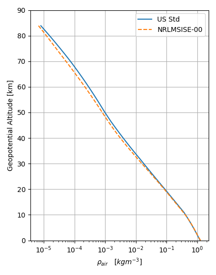

# Background

The US Standard Atmosphere is a model that describes the variation of temperature, pressure, and density with altitude. It was first published in 1958 and last updated in 1976. 

The model separates the atmosphere into regions with linear, or constant, temperature variation with geopotential altitude. The geopotential altitude accounts for the variation of acceleration due to gravity with geometric height. The variation of pressure with geopotential altitude is calculated by solving the hydrostatic equation. The density is calculated assuming an ideal gas law. 

Herein we implement the US Standard Atmosphere 1976 up to a geometric altitude of 86 km in Python code, and benchmarking against predictions from the NRLMSISE-00 obtained with the Amentum API.

More information on the US Standard Atmosphere can be found in the original technical report [here](https://ntrs.nasa.gov/search.jsp?R=19770009539). 

# Results

Figure 1: Temperature profile for geometric altitudes less than 86 km as prediced by the US Standard Atmosphere (1976) and the NRLMSISE-00 model, accessed using the Amentum web API.  

 

 Figure 2: Same as Figure 1 for atmospheric mass density.

