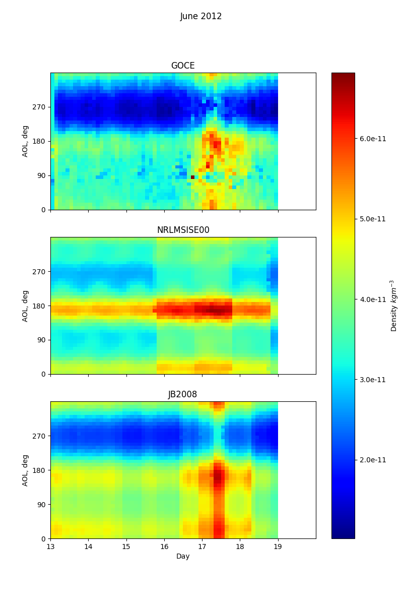

# Background

The GOCE (Gravity Field and Steady-State Ocean Circulation Explorer) mission of the European Space Agency mapped the Earth's gravity field with unprecedented resolution and accuracy. 

The mission objectives demanded an unusually low altitude orbit with an electric ion engine providing continuous thrust to compensate for drag, as well as unique (and cool looking) aerodynamic stablising fins.

GOCE's instruments also provided the world with valuable insights into the density and winds of the atmosphere. 

The following study validates the NRLMSISE-00 and JB2008 endpoints of the Amentum API by comparing results of API calls with experimental data obtained during the GOCE mission. A 2D distribution of atmospheric mass density is calculated as a function of Argument of Latitude and number of days from a nominated start-date (see instructions below). A 1D time series of density versus days is calculated for a given interval of Argument of Latitude.

More information on the mission can be found [here](https://earth.esa.int/web/guest/missions/esa-eo-missions/goce/mission-summary). 

# Run time environment

Install the required Python packages using pip like so

    pip install -r requirements.txt 

# Run the analysis

    $ python analysis.py -h
        usage: analysis.py [-h] [--hostname HOSTNAME][--start_date START_DATE][--goce_dir GOCE_DIR]

        optional arguments:
        -h, --help            show this help message and exit
        --hostname HOSTNAME   specify an alternative hostname for testing (e.g. dedicated API server)
        --start_date START_DATE specify the start date for the analysis as YYYYMMDD
        --goce_dir GOCE_DIR   specify path to directory containing extracted goce data archive

Results are saved as PNG files in the same directory.

# Batch analysis

Generate validation plots for a 7 day period commencing on the 13th of each month in 2012. NOTE: This may exceed the maximum number of API calls under the trial plan, contact team@amentum.space for commercial access plans.

    bash batch_run.sh
    
# Results

A sample of results are provided below.

Figure 1: Thermospheric density distributions as measured by GOCE, and as calculated by the NRLMSISE00 and JB2008 models accessed via the Amentum Aerospace API, for a week in June 2012.

Figure 2: The time profile of density from Figure 1 at a given Argument of Latitude interval, measured and calculated.

# TODO 

- update image
- create bash script to batch processes monthly data and create annual animation
- fix ticks on time axis

# Data sources 

See [here](https://earth.esa.int/web/guest/missions/esa-operational-missions/goce/goce-thermospheric-data ) for GOCE thermospheric density data used in this study.

Copyright 2020 [Amentum Aerospace](https://amentum.space), Australia
