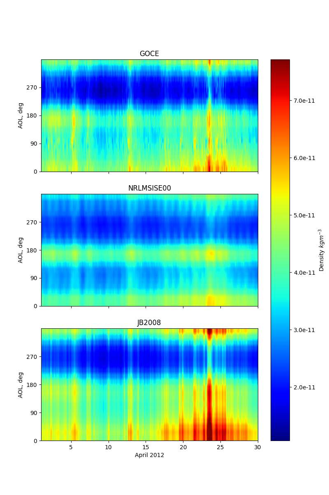
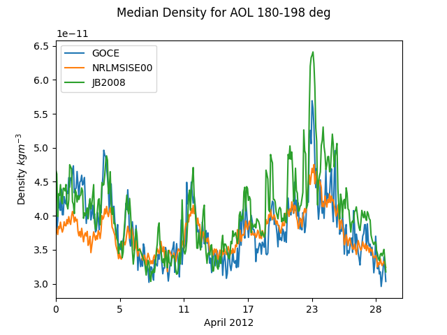

# Background

The GOCE (Gravity Field and Steady-State Ocean Circulation Explorer) mission of the European Space Agency mapped the Earth's gravity field with unprecedented resolution and accuracy. 

The mission objectives demanded an unusually low altitude orbit with an electric ion engine providing continuous thrust to compensate for drag, as well as unique (and cool looking) aerodynamic stablising fins.

GOCE's instruments also provided the world with valuable insights into the density and winds of the atmosphere. 

The following study validates the NRLMSISE-00 and JB2008 endpoints of the Amentum API by comparing results of API calls with experimental data obtained during the GOCE mission. A 2D distribution of atmospheric mass density is calculated as a function of [Argument of Latitude](https://en.wikipedia.org/wiki/Argument_of_latitude) and day in the month. A 1D time series of density versus days is calculated for a given interval of Argument of Latitude.

More information on the mission can be found [here](https://earth.esa.int/web/guest/missions/esa-eo-missions/goce/mission-summary). 

# Run time environment

Install the required Python packages using pip like so

    pip install -r requirements.txt 

# Run the analysis

    $ python analysis.py -h
            
    usage: analysis.py [-h] [--host HOST] --goce_file GOCE_FILE [--api_key API_KEY]

    optional arguments:
    -h, --help            show this help message and exit
    --host HOST           Alternative host for testing (e.g. on-premises API server)
    --goce_file GOCE_FILE
                            Path to text file containing GOCE density and wind data time series (goce_denswind_ac082_v2_0_YYYY-MM.txt)
    --api_key API_KEY     valid API key obtained from https://developer.amentum.io

Results are saved as PNG files in the same directory as the data files. 

There is a simple bash script to process all GOCE data files in the directory (`run.sh`).
    
# Results

A sample of results are provided below.

Figure 1: Thermospheric density distributions as measured by GOCE and calculated by the NRLMSISE00 and JB2008 models accessed via the Amentum Atmosphere API.

Figure 2: The time profile of density from Figure 1 at a given Argument of Latitude interval, measured and calculated.

# Acknowledgement 

ESA GOCE Online Dissemination Service for provision of thermospheric density data, which is available for download [here](https://earth.esa.int/web/guest/missions/esa-operational-missions/goce/goce-thermospheric-data).

Copyright 2021 [Amentum Aerospace](https://amentum.space), Australia.
