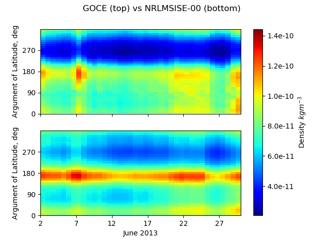
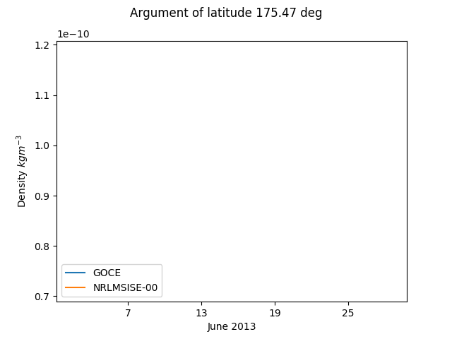

# Background

The GOCE (Gravity Field and Steady-State Ocean Circulation Explorer) mission of the European Space Agency mapped the Earth's gravity field with unprecedented resolution and accuracy. 

The mission objectives demanded an unusually low altitude orbit with an electric ion engine providing continuous thrust to compensate for drag, as well as unique (and cool looking) aerodynamic stablising fins.

GOCE's instruments also provided the world with valuable insights into the density and winds of the atmosphere. 

The following study validates the NRLMSISE-00 and JB2008 endpoints of the Amentum API by comparing results of API calls with experimental data obtained during the GOCE mission. 

More information on the mission can be found [here](https://earth.esa.int/web/guest/missions/esa-eo-missions/goce/mission-summary). 

# Development environment

You can install the required Python packages using pip like so

    pip install -r requirements.txt 
    
# Results

Figure 1: Thermospheric density distributions for June 2013

 

Figure 2: Density profile for an argument of latitude of 175 degrees for June 2013

# Data sources 

See [here](https://earth.esa.int/web/guest/missions/esa-operational-missions/goce/goce-thermospheric-data ) for GOCE thermospheric density data used in this study, 

[ftp://ftp.gfz-potsdam.de/pub/home/obs/kp-ap/tab/](ftp://ftp.gfz-potsdam.de/pub/home/obs/kp-ap/tab/) for geomagnetic indices, and 

[ftp://ftp.swpc.noaa.gov/pub/warehouse](ftp://ftp.swpc.noaa.gov/pub/warehouse) for radio flux data.
